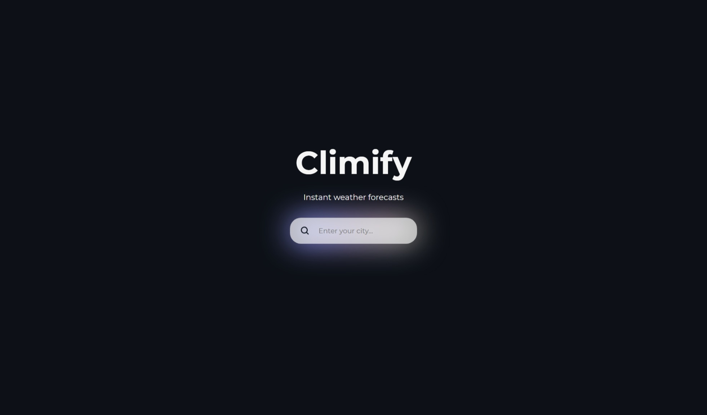
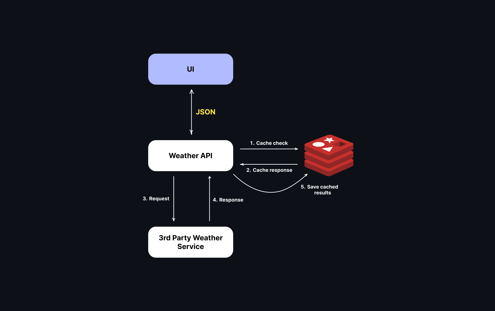

# Climify ⛅
A responsive web application that showcases current weather conditions in cities.

---


---

## Features
- Displays real-time weather conditions.
- Responsive design for optimal viewing on various devices.
## Technologies Used

### Backend
- **Java 21** (Maven)
- **Spring Boot** and **Spring MVC**
- **Redis** for caching
- **OpenAPI** and **Swagger UI** for API documentation
- **Docker**

### Frontend
- **HTML**, **CSS**, **JavaScript**
- **React** for building the user interface

## How It Works
Climify fetches and returns weather data from a [third-party API](https://www.visualcrossing.com/), providing users with up-to-date information on temperature, humidity, wind speed, and more.

---


---
## Getting Started
### Prerequisites
- Java 21
- Maven
- Node.js and npm
- Redis

### Installation
1. Clone the repository:
   ```bash
   git clone https://github.com/lim0sha/Climify.git
   ```

2. Navigate to the project directory:
   ```bash
   cd Climify
   ```
3. Create a `.env` file in the root directory
4. Login into your account on https://www.visualcrossing.com/ and get your API key
5. Add a parameter `VC_API_KEY=your-api-key` to `.env` file 

6. Start Redis via Docker:
   ```bash
   docker run -d --name redis-container -p 6379:6379 redis
   ```
7. Install backend dependencies:
   ```bash
   mvn install
   ```

8. Start the backend server:
   ```bash
   mvn spring-boot:run
   ```

9. Navigate to the frontend directory:
   ```bash
   cd frontend
   ```

10. Install frontend dependencies:
    ```bash
    npm install
    ```

11. Start the frontend development server:
    ```bash
    npm start
    ```

12. Open your browser and visit `http://localhost:3000` to see the application in action.

## API Documentation
API documentation is available via Swagger UI at `http://localhost:8080/swagger-ui/index.html#/`.

## License
This project is licensed under the MIT License - see the [LICENSE.md](docs/src/LICENSE.md) file for details.

## Contact
For any questions or feedback, please contact me at [limosha@inbox.ru](mailto:contact@example.com).

---
Feel free to customize this further to better fit your needs!